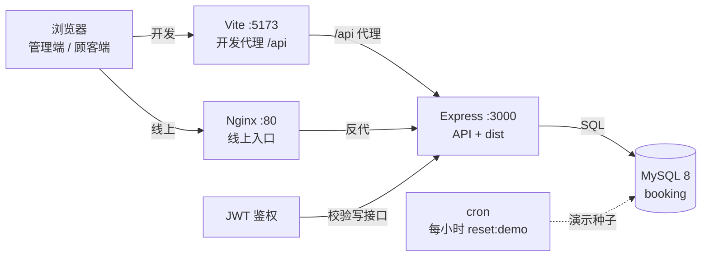

# 预约后台管理系统

面向服务类门店：顾客端预约、管理端后台。前端 Vue 3 + Vite + Element Plus，后端 Node.js + Express，数据存 MySQL。开发时浏览器访问前端，`/api` 由 Vite 转到 Express，看起来仍是同域。

- 在线演示：[http://120.27.130.34](http://120.27.130.34)
- 源码：[https://github.com/Lumos661514/RBMS](https://github.com/Lumos661514/RBMS)

## 运行架构

交互图（Archify）：[docs/archify/runtime-architecture.html](docs/archify/runtime-architecture.html)（源数据：`docs/archify/runtime-architecture.architecture.json`）。



- **本地：** `npm run dev` 同时起 Express 与 Vite；浏览器打 Vite，接口经代理到 `:3000`。
- **线上：** Nginx → Express；同进程托管 `dist` 静态页与 `/api`，数据在 MySQL；cron 每小时 `reset:demo`。

## 账号

- 演示站默认关闭公开注册；登录页可一键填入「演示顾客」。
- 店长账号系统自带，密码只在服务端 `ADMIN_PASSWORD`，不写进前端或 README；登录后进入后台看板。两边菜单和路由分开，不能互相串。

## 功能

- **顾客端：** 顶栏菜单为「项目 / 我的」。项目介绍展示价格、时长，有简介才显示简介（空着或写成「无」都不展示），可选图片，没有图片时用占位。点预约后按步骤选择日期、员工和时段，核对摘要再提交。「我的」分个人信息、进行中的预约、消费记录、修改密码；改自己的密码要填原密码，并把新密码输入两次。未开始的预约在开约前 30 分钟内不可取消。到点后预约进入消费记录并计入总计。别人的预约不会出现在自己的列表接口里。
- **管理端看板：** 从今日起按设置画出时段表。管理员代约普通用户（不能约自己），可查看并取消格内全部预约。
- **员工与容量：** 预约须选该时段空闲且未请假的员工；请假在员工管理里按营业时间内的时段设置（可到分钟），重叠格子不计入容量、下拉不可选；同一员工同时段不可重复约；同一用户同时段只能约一名员工；该格可上班员工约满才关格。
- **用户管理：** 普通用户在「我的」查看个人信息、未开始的预约、到点后的消费记录与总计消费，并修改自己的密码（须验证原密码）。管理员可搜索普通用户、直接重置其密码（不需要原密码）、删除账号（不删除已有预约记录）。
- **项目介绍 / 项目管理：** 顾客端介绍页展示价格、时长与简介，可直接预约。简介可留空。管理员在「项目管理」新增、修改、删除项目，可选填 http(s) 图片地址；保存时时长须为当前时间格的整数倍；变更同步到顾客端介绍页。已产生的预约仍保留当时的项目名。
- **员工管理（仅管理员）：** 添加/编辑员工、勾选可做项目、按营业时间设置请假时段，并显示当前状态（请假 / 空闲 / 在忙）。
- **占用与营收（仅管理员）：** 按看板区间看每日占用率、项目营收、员工饱和度。
- **系统设置（仅管理员）：** 营业起止整点、时间格（最低 30 分钟、步进 30）、看板列数（最少 7）。
- **时段规则：** 已过开始时刻不可再约；到点后看板清空占用，记录保留为「已结束」。


## 本地运行

需要 Node 18+ 和 MySQL 8。

```bash
cp .env.example .env
# 按本机 MySQL 改 DB_USER / DB_PASSWORD；库名默认 booking，没有会自动建
# JWT_SECRET 换成一串随机字符
# 也可用 Docker：docker compose up -d

npm install
npm run dev
```

首次启动会建表；`users` 为空时只写入内置管理员，项目、员工和预约需在后台添加。之后读写都在 MySQL。密码以哈希存放，登录签发 JWT。

公网演示站可用 `npm run reset:demo` 清空可变业务数据并写入固定种子（项目、员工、演示顾客）；线上建议 cron 每小时执行，并开启 `DISABLE_REGISTER` / 写接口限流 / `DEMO_ROW_CAP`。

调度规则单测：`npm test`。

